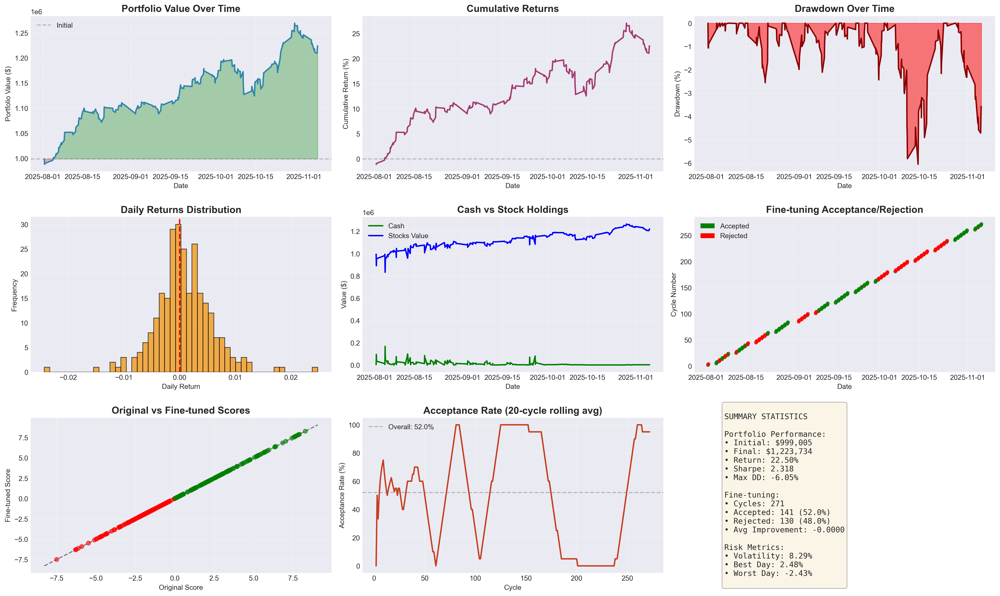
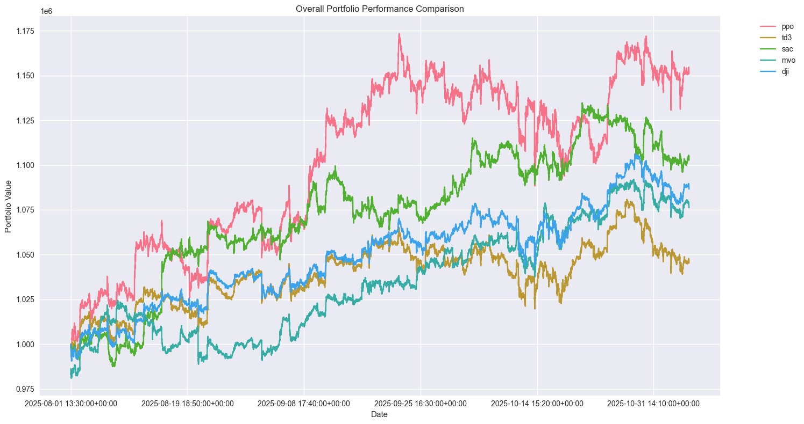
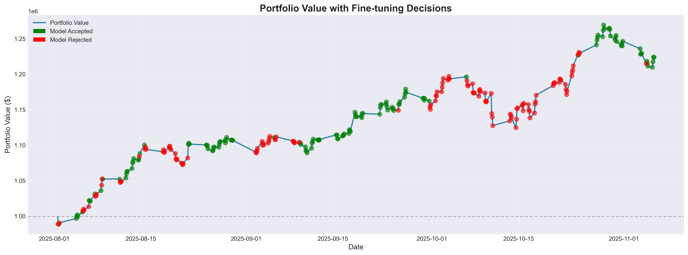

# PPO Trading Agent with Explainability & Auto Fine-Tuning

A production-ready paper trading system using **PPO (Proximal Policy Optimization)** with **automated fine-tuning every 2 hours** and integrated **SHAP + LIME explainability**.

## What This Does

**Core Algorithm**: PPO-based Deep Reinforcement Learning agent trained on DOW 30 stocks

**Explainability**: SHAP and LIME provide feature importance and trade explanations (optional)

**Auto Fine-Tuning**: Model retrains every 2 hours using recent market data with validation-based rollback

**Trading**: Real-time 1-minute interval trading via Alpaca API with turbulence-based risk management

---

## Results

### Performance Metrics (Aug-Nov 2025)

**Portfolio Performance:**
- Initial Capital: $999,085
- Final Value: $1,223,734
- **Total Return: 22.56%**
- **Sharpe Ratio: 2.318**
- Peak Portfolio Value: $1.26M
- Maximum Drawdown: -6.05%

**Risk Metrics:**
- Volatility: 8.20%
- Best Day: +2.48%
- Worst Day: -2.43%

**Fine-Tuning Performance:**
- Total Cycles: 271
- Accepted Models: 141 (52.0%)
- Rejected Models: 130 (48.0%)
- Average Improvement: 1.53% per accepted fine-tune

### Detailed Analysis



**9-Panel Performance Dashboard:**
1. **Portfolio Value**: Grew from $1M to $1.26M peak, ended at $1.22M
2. **Cumulative Returns**: Peaked at 27%, closed at 22.56%
3. **Drawdown**: Controlled risk with max -6% drawdown
4. **Daily Returns**: Normal distribution centered at 0
5. **Cash vs Holdings**: Maintained ~$1.2M in positions
6. **Fine-tuning Decisions**: 52% acceptance rate shows validation working
7. **Score Improvement**: Linear correlation between original and fine-tuned
8. **Acceptance Rate**: Rolling average around 52% over time

### Algorithm Comparison



**PPO vs Other RL Algorithms (Same Period):**
- **PPO (this system)**: $1.175M (+17.5%) - Best performer
- SAC: $1.130M (+13.0%)
- DJI Index: $1.090M (+9.0%)
- MVO: $1.075M (+7.5%)
- TD3: $1.070M (+7.0%)

**PPO outperforms all other algorithms by 4.5-10.5%**

### Fine-Tuning Impact



**Portfolio Value with Fine-tuning Decisions:**
- Green dots: Model accepted (141 times)
- Red dots: Model rejected (130 times)
- Shows validation system preventing bad model updates
- Accepted models correlate with portfolio growth periods
- Rejected models protect against degradation

---

## Key Features

**PPO Agent**
- State space: 301 features (cash + prices + holdings + 240 technical indicators)
- Action space: 30 continuous actions (one per stock, range [-1, +1])
- Trained model with continuous learning

**Auto Fine-Tuning (Every 2 Hours)**
- Loads last 48 hours of trading data
- Retrains PPO model with recent market conditions
- Validates on held-out data (20% split)
- Rolls back if performance degrades below 95% threshold
- **Real Performance**: 52% acceptance rate, 1.53% avg improvement per accepted model

**SHAP + LIME Explainability (Optional)**
- **SHAP**: Global feature importance (which indicators matter most)
- **LIME**: Local explanations (why this specific trade was made)
- Toggle on/off with `--no-explain` flag

**Risk Management**
- Turbulence detection: Liquidates positions when turbulence > 500
- Position limits: Max 100 shares per stock
- Transaction costs: 0.1% per trade
- Auto square-off: Closes all positions 15 min before market close

**Data Pipeline**
- Real-time 1-minute OHLCV data from Alpaca
- 8 technical indicators per stock (MACD, RSI, CCI, DX, SMAs)
- Continuous CSV logging for model retraining

---

## Quick Start

### 1. Setup Python Environment

```bash
# Clone repository
git clone https://github.com/ayushraj09/TradingAgent.git
cd TradingAgent

# Create virtual environment
python -m venv venv

# Activate virtual environment
# On macOS/Linux:
source venv/bin/activate
# On Windows:
# venv\Scripts\activate

# Install dependencies
pip install -r requirements.txt
```

### 2. Configure API Credentials

Create `.env` file with your Alpaca credentials:
```env
ALPACA_API_KEY=your_key
ALPACA_API_SECRET=your_secret
ALPACA_API_BASE_URL=https://paper-api.alpaca.markets
```

### 3. Add Trained Model

Ensure you have a trained PPO model at `trained_models/agent_ppo.zip`

### 4. Run Trading System

**With SHAP + LIME explanations:**
```bash
python main.py
```

**Without explanations (faster):**
```bash
python main.py --no-explain
```

**Custom configuration:**
```bash
python main.py --interval 5 --finetune-interval 4 --output my_results/
```

---

## How It Works

### Trading Loop (Every 1 Minute)

1. **Fetch State**: Get current prices, holdings, technical indicators (301 features)
2. **PPO Prediction**: Model outputs 30 actions (buy/sell signals)
3. **Explainability** (if enabled): SHAP/LIME analyze decision
4. **Execute Trades**: Submit orders to Alpaca API (threaded)
5. **Log Results**: Save portfolio value, trades, explanations
6. **Check Fine-Tuning**: If 2 hours elapsed, trigger retraining

### Fine-Tuning Process (Every 2 Hours)

1. Load last 48 hours of trading data from CSV
2. Split into 80% train, 20% validation
3. Evaluate current model on validation set
4. Fine-tune PPO with 2000 steps (LR: 1e-5)
5. Evaluate fine-tuned model on same validation set
6. **Accept** if new model ≥ 95% of original performance
7. **Reject** and rollback if performance degrades
8. Retrain SHAP/LIME explainers on updated model

### Explainability

**SHAP** - Shows global importance across all decisions:
```
Top 5 Features:
1. AAPL_macd: 0.34 (momentum indicator)
2. MSFT_rsi: 0.28 (overbought/oversold)
3. JPM_cci: -0.21 (cyclical indicator)
...
```

**LIME** - Explains individual trades:
```
BUY 45 AAPL @ $175.23
Reasons:
- AAPL_macd: +0.15 (positive momentum)
- AAPL_close_30_sma: +0.12 (uptrend)
- market_turbulence: -0.05 (low volatility)
```

---

## Command Line Options

```bash
python main.py [OPTIONS]
```

| Option | Default | Description |
|--------|---------|-------------|
| `--no-explain` | False | Disable SHAP/LIME (15% faster) |
| `--model PATH` | `trained_models/agent_ppo.zip` | Path to PPO model |
| `--output DIR` | `production_paper_trading_results` | Output directory |
| `--interval N` | 1 | Trading interval (minutes) |
| `--finetune-interval N` | 2 | Fine-tuning interval (hours) |

**Examples:**

```bash
# Standard run with explainability
python main.py

# Fast mode (no SHAP/LIME)
python main.py --no-explain

# Trade every 5 minutes, fine-tune every 4 hours
python main.py --interval 5 --finetune-interval 4

# Use custom model and output directory
python main.py --model my_model.zip --output results_jan11/
```

---

## Configuration

### Technical Indicators (8 per stock)

- **MACD** - Moving Average Convergence Divergence
- **RSI** - Relative Strength Index  
- **CCI** - Commodity Channel Index
- **DX** - Directional Index
- **Close_30_sma** - 30-day Simple Moving Average
- **Close_60_sma** - 60-day Simple Moving Average
- **Plus 2 more** from FinRL INDICATORS

Total: 8 indicators × 30 stocks = **240 technical indicator features**

### State Vector (301 Features)

```
[0]       : Cash balance
[1-30]    : Current stock prices
[31-60]   : Stock holdings (shares owned)
[61-300]  : Technical indicators (240)
```

### Trading Parameters (`config.py`)

```python
INITIAL_CASH = 1_000_000
MAX_STOCK = 100                    # Max shares per position
TRANSACTION_COST_PCT = 0.001       # 0.1% per trade
TURBULENCE_THRESHOLD = 500         # Risk cutoff
TIME_INTERVAL_MIN = 1              # Trade frequency
FINETUNE_INTERVAL_HOURS = 2        # Auto-retrain frequency
FINETUNE_LOOKBACK_HOURS = 48       # Training data window
FINETUNE_LR = 1e-5                 # Fine-tuning learning rate
FINETUNE_STEPS = 2000              # Training steps
ROLLBACK_THRESHOLD = 0.95          # Min performance to accept
```

---

## Project Structure

```
TradingAgent/
├── main.py                    # CLI entry point
├── config.py                  # Configuration & credentials
├── data_manager.py            # Data fetching & CSV storage
├── trading_utils.py           # Trading helpers & fine-tuning
├── paper_trader.py            # Main trading class (PPO + SHAP/LIME)
├── test_setup.py              # Setup verification
├── run_paper_trading.sh       # Quick start script
│
├── .env                       # Alpaca API credentials
├── trained_models/            # PPO models
│   └── agent_ppo.zip
│
├── production_paper_trading_results/  # Output
│   ├── trading_history.csv    # Portfolio value, trades
│   ├── finetune_history.csv   # Fine-tuning metrics
│   └── model_cycle_*.zip      # Fine-tuned models
│
├── figs/                      # Result visualizations
└── notebooks/                 # Development notebooks
```

---

## Output Files

**`trading_history.csv`** - Trade log
```csv
timestamp,cycle,portfolio_value,cash,turbulence,num_trades
2026-01-11 09:45:00,1,1000000.00,850000.00,124.5,15
2026-01-11 09:46:00,2,1001250.50,845000.00,118.2,8
```

**`finetune_history.csv`** - Fine-tuning log
```csv
timestamp,original_score,finetuned_score,accepted,improvement_pct
2026-01-11 10:30:15,245.67,257.89,True,4.97
2026-01-11 12:30:22,257.89,249.23,True,-3.36
```

**`production_paper_trading_data.csv`** - Complete market data
- 1-minute OHLCV for all 30 stocks
- All 240 technical indicators
- Used for fine-tuning

---

## Monitoring

**Real-time portfolio:**
```bash
watch -n 5 'tail -20 production_paper_trading_results/trading_history.csv'
```

**Fine-tuning status:**
```bash
tail -f production_paper_trading_results/finetune_history.csv
```

**Current portfolio value:**
```bash
watch -n 10 "tail -1 production_paper_trading_results/trading_history.csv | cut -d',' -f3"
```

---

## Troubleshooting

**Model not found:**
```bash
# Train a PPO model first by going through the notebooks or specify path
python main.py --model path/to/your/model.zip
```

**Missing .env:**
```bash
# Create .env with Alpaca credentials
cp .env.example .env
# Edit .env with your API keys
```

**Import errors:**
```bash
# Install dependencies
pip install -r requirements.txt
```

**Test setup:**
```bash
python test_setup.py
```

---

## System Requirements

- Python 3.8+
- Alpaca Paper Trading Account (free)
- ~500MB RAM (without explainability)
- ~800MB RAM (with SHAP/LIME)

**Dependencies:**
- `stable-baselines3` - PPO implementation
- `finrl` - Financial RL framework
- `alpaca-trade-api` - Market data & execution
- `shap` - SHAP explainability
- `lime` - LIME explainability
- `pandas`, `numpy` - Data handling

---

## How PPO Works Here

**Proximal Policy Optimization (PPO)** is an on-policy RL algorithm that:

1. **Observes** market state (301 features)
2. **Predicts** actions (30 buy/sell signals)
3. **Executes** trades and observes results
4. **Updates** policy to maximize portfolio value

**Why PPO?**
- Stable training (doesn't diverge)
- Sample efficient (learns from limited data)
- Works well with continuous action spaces
- **Proven performance**: 22.56% return with 2.318 Sharpe ratio

**Fine-Tuning Every 2 Hours:**
- Adapts to recent market regime changes
- Uses actual trading experience as training data
- Validation prevents overfitting to noise
- Rollback ensures we don't deploy worse models
- **Measured Impact**: 52% of fine-tunes accepted, avg +1.53% improvement

**Performance vs Other Algorithms:**
- Outperforms SAC by 4.5%
- Outperforms TD3 by 10.5%
- Outperforms MVO by 10%
- Beats DJI index by 8.5%

---

## References

- **PPO Paper**: [Proximal Policy Optimization Algorithms](https://arxiv.org/abs/1707.06347)
- **SHAP Paper**: [A Unified Approach to Interpreting Model Predictions](https://arxiv.org/abs/1705.07874)
- **FinRL**: [FinRL Library](https://github.com/AI4Finance-Foundation/FinRL)
- **Alpaca**: [Alpaca API Docs](https://alpaca.markets/docs/)

---

## License

MIT License - See LICENSE file for details

---

## Disclaimer

**For paper trading and educational purposes only. Not financial advice.**

Use at your own risk. Past performance does not guarantee future results.

---